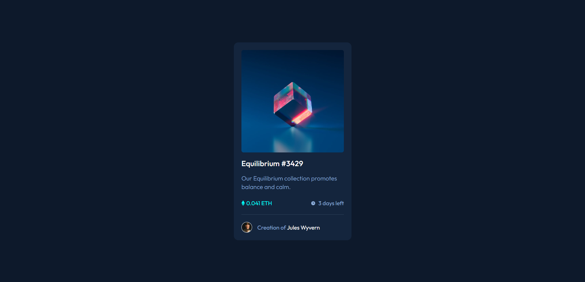

# NFT Preview Card Component

Este projeto é um componente de cartão de visualização de NFTs, desenvolvido como parte de um desafio do Frontend Mentor. Meu objetivo foi criar um componente que se pareça o mais próximo possível do design fornecido, praticando minhas habilidades de CSS e design responsivo.

Você pode visualizar o componente em ação <a href="https://joaopaulo04.github.io/nft-preview-card/">aqui.</a>

## 🛠️ Tecnologias utilizadas
* HTML: Estruturação do conteúdo do cartão.
* CSS: Estilização do cartão, incluindo responsividade e estados de foco.
* Git: Controle de versão do projeto.

